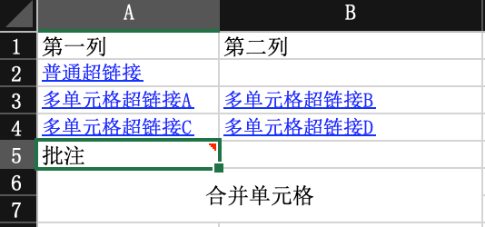

## 额外信息（批注、超链接、合并单元格信息读取）

### since

2.0.0-beta1

### excel示例



### 对象

```java
@Getter
@Setter
@EqualsAndHashCode
public class DemoExtraData {

    private String row1;

    private String row2;
}
```

### 监听器

参照：[最简单的读的监听器](easyRead#最简单的读的监听器)
里面多了一个 `extra` 方法

```java
@Slf4j
public class DemoExtraListener implements ReadListener<DemoExtraData> {

    @Override
    public void invoke(DemoExtraData data, AnalysisContext context) {}

    @Override
    public void doAfterAllAnalysed(AnalysisContext context) {}

    @Override
    public void extra(CellExtra extra, AnalysisContext context) {
        log.info("读取到了一条额外信息:{}", JSON.toJSONString(extra));
        switch (extra.getType()) {
            case COMMENT:
                log.info("额外信息是批注,在rowIndex:{},columnIndex;{},内容是:{}", extra.getRowIndex(), extra.getColumnIndex(),
                    extra.getText());
                break;
            case HYPERLINK:
                if ("Sheet1!A1".equals(extra.getText())) {
                    log.info("额外信息是超链接,在rowIndex:{},columnIndex;{},内容是:{}", extra.getRowIndex(),
                        extra.getColumnIndex(), extra.getText());
                } else if ("Sheet2!A1".equals(extra.getText())) {
                    log.info(
                        "额外信息是超链接,而且覆盖了一个区间,在firstRowIndex:{},firstColumnIndex;{},lastRowIndex:{},lastColumnIndex:{},"
                            + "内容是:{}",
                        extra.getFirstRowIndex(), extra.getFirstColumnIndex(), extra.getLastRowIndex(),
                        extra.getLastColumnIndex(), extra.getText());
                } else {
                    Assert.fail("Unknown hyperlink!");
                }
                break;
            case MERGE:
                log.info(
                    "额外信息是超链接,而且覆盖了一个区间,在firstRowIndex:{},firstColumnIndex;{},lastRowIndex:{},lastColumnIndex:{}",
                    extra.getFirstRowIndex(), extra.getFirstColumnIndex(), extra.getLastRowIndex(),
                    extra.getLastColumnIndex());
                break;
            default:
        }
    }
}
```

### 代码

```java
    /**
     * 额外信息（批注、超链接、合并单元格信息读取）
     * <p>
     * 由于是流式读取，没法在读取到单元格数据的时候直接读取到额外信息，所以只能最后通知哪些单元格有哪些额外信息
     *
     * <p>
     * 1. 创建excel对应的实体对象 参照{@link DemoExtraData}
     * <p>
     * 2. 由于默认异步读取excel，所以需要创建excel一行一行的回调监听器，参照{@link DemoExtraListener}
     * <p>
     * 3. 直接读即可
     *
     * @since 2.2.0-beat1
     */
    @Test
    public void extraRead() {
        String fileName = TestFileUtil.getPath() + "demo" + File.separator + "extra.xlsx";
        // 这里 需要指定读用哪个class去读，然后读取第一个sheet
        EasyExcel.read(fileName, DemoExtraData.class, new DemoExtraListener())
            // 需要读取批注 默认不读取
            .extraRead(CellExtraTypeEnum.COMMENT)
            // 需要读取超链接 默认不读取
            .extraRead(CellExtraTypeEnum.HYPERLINK)
            // 需要读取合并单元格信息 默认不读取
            .extraRead(CellExtraTypeEnum.MERGE).sheet().doRead();
    }
```