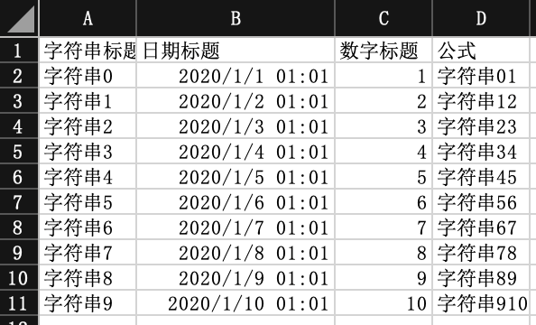

## 读取公式和单元格类型

### excel示例



### 对象

```java
@Getter
@Setter
@EqualsAndHashCode
public class CellDataReadDemoData {
    private CellData<String> string;
    // 这里注意 虽然是日期 但是 类型 存储的是number 因为excel 存储的就是number
    private CellData<Date> date;
    private CellData<Double> doubleData;
    // 这里并不一定能完美的获取 有些公式是依赖性的 可能会读不到 这个问题后续会修复
    private CellData<String> formulaValue;
}
```

### 监听器

参照：[最简单的读的监听器](easyRead#最简单的读的监听器)
代码

```java
       /**
     * 读取公式和单元格类型
     *
     * <p>
     * 1. 创建excel对应的实体对象 参照{@link CellDataReadDemoData}
     * <p>
     * 2. 由于默认一行行的读取excel，所以需要创建excel一行一行的回调监听器，参照{@link DemoHeadDataListener}
     * <p>
     * 3. 直接读即可
     *
     * @since 2.2.0-beat1
     */
    @Test
    public void cellDataRead() {
        String fileName = TestFileUtil.getPath() + "demo" + File.separator + "cellDataDemo.xlsx";
        // 这里 需要指定读用哪个class去读，然后读取第一个sheet
        EasyExcel.read(fileName, CellDataReadDemoData.class, new CellDataDemoHeadDataListener()).sheet().doRead();
    }
```
