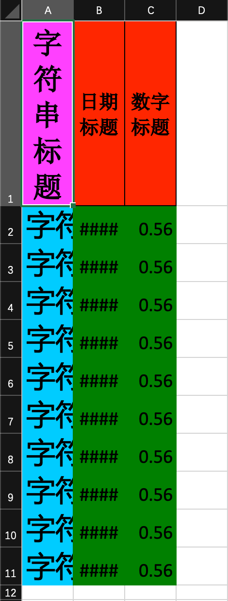

## 注解形式自定义样式

### since

2.2.0-beta1

### excel示例



### 对象

```java
@Getter
@Setter
@EqualsAndHashCode
// 头背景设置成红色 IndexedColors.RED.getIndex()
@HeadStyle(fillPatternType = FillPatternTypeEnum.SOLID_FOREGROUND, fillForegroundColor = 10)
// 头字体设置成20
@HeadFontStyle(fontHeightInPoints = 20)
// 内容的背景设置成绿色 IndexedColors.GREEN.getIndex()
@ContentStyle(fillPatternType = FillPatternTypeEnum.SOLID_FOREGROUND, fillForegroundColor = 17)
// 内容字体设置成20
@ContentFontStyle(fontHeightInPoints = 20)
public class DemoStyleData {
    // 字符串的头背景设置成粉红 IndexedColors.PINK.getIndex()
    @HeadStyle(fillPatternType = FillPatternTypeEnum.SOLID_FOREGROUND, fillForegroundColor = 14)
    // 字符串的头字体设置成20
    @HeadFontStyle(fontHeightInPoints = 30)
    // 字符串的内容的背景设置成天蓝 IndexedColors.SKY_BLUE.getIndex()
    @ContentStyle(fillPatternType = FillPatternTypeEnum.SOLID_FOREGROUND, fillForegroundColor = 40)
    // 字符串的内容字体设置成20
    @ContentFontStyle(fontHeightInPoints = 30)
    @ExcelProperty("字符串标题")
    private String string;
    @ExcelProperty("日期标题")
    private Date date;
    @ExcelProperty("数字标题")
    private Double doubleData;
}/**
 * 样式的数据类
 *
 * @author Jiaju Zhuang
 **/
@Data
// 头背景设置成红色 IndexedColors.RED.getIndex()
@HeadStyle(fillPatternType = FillPatternType.SOLID_FOREGROUND, fillForegroundColor = 10)
// 头字体设置成20
@HeadFontStyle(fontHeightInPoints = 20)
// 内容的背景设置成绿色 IndexedColors.GREEN.getIndex()
@ContentStyle(fillPatternType = FillPatternType.SOLID_FOREGROUND, fillForegroundColor = 17)
// 内容字体设置成20
@ContentFontStyle(fontHeightInPoints = 20)
public class DemoStyleData {
    // 字符串的头背景设置成粉红 IndexedColors.PINK.getIndex()
    @HeadStyle(fillPatternType = FillPatternType.SOLID_FOREGROUND, fillForegroundColor = 14)
    // 字符串的头字体设置成20
    @HeadFontStyle(fontHeightInPoints = 30)
    // 字符串的内容的背景设置成天蓝 IndexedColors.SKY_BLUE.getIndex()
    @ContentStyle(fillPatternType = FillPatternType.SOLID_FOREGROUND, fillForegroundColor = 40)
    // 字符串的内容字体设置成20
    @ContentFontStyle(fontHeightInPoints = 30)
    @ExcelProperty("字符串标题")
    private String string;
    @ExcelProperty("日期标题")
    private Date date;
    @ExcelProperty("数字标题")
    private Double doubleData;
}
```

### 代码

```java
    /**
     * 注解形式自定义样式
     * <p>
     * 1. 创建excel对应的实体对象 参照{@link DemoStyleData}
     * <p>
     * 3. 直接写即可
     *
     * @since 2.2.0-beta1
     */
    @Test
    public void annotationStyleWrite() {
        String fileName = TestFileUtil.getPath() + "annotationStyleWrite" + System.currentTimeMillis() + ".xlsx";
        // 这里 需要指定写用哪个class去写，然后写到第一个sheet，名字为模板 然后文件流会自动关闭
        EasyExcel.write(fileName, DemoStyleData.class).sheet("模板").doWrite(data());
    }
```

