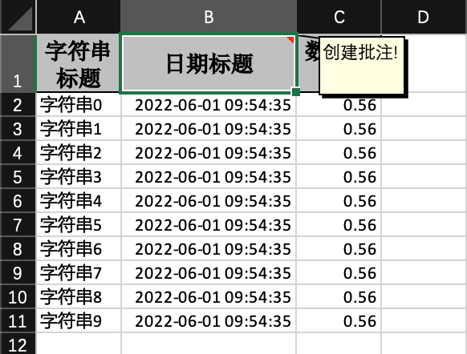

## 插入批注

### excel示例



### 对象

参照：[最简单的写的对象](simpleWrite#最简单的写的对象)

### 定义拦截器

```java
/**
 * 自定义拦截器.新增注释,第一行头加批注
 *
 * @author Jiaju Zhuang
 */
@Slf4j
public class CommentWriteHandler implements RowWriteHandler {

    @Override
    public void afterRowDispose(RowWriteHandlerContext context) {
        if (BooleanUtils.isTrue(context.getHead())) {
            Sheet sheet = context.getWriteSheetHolder().getSheet();
            Drawing<?> drawingPatriarch = sheet.createDrawingPatriarch();
            // 在第一行 第二列创建一个批注
            Comment comment =
                drawingPatriarch.createCellComment(new XSSFClientAnchor(0, 0, 0, 0, (short)1, 0, (short)2, 1));
            // 输入批注信息
            comment.setString(new XSSFRichTextString("创建批注!"));
            // 将批注添加到单元格对象中
            sheet.getRow(0).getCell(1).setCellComment(comment);
        }
    }

}

```

### 代码

```java
    /**
     * 插入批注
     * <p>
     * 1. 创建excel对应的实体对象 参照{@link DemoData}
     * <p>
     * 2. 注册拦截器 {@link CommentWriteHandler}
     * <p>
     * 2. 直接写即可
     */
    @Test
    public void commentWrite() {
        String fileName = TestFileUtil.getPath() + "commentWrite" + System.currentTimeMillis() + ".xlsx";
        // 这里 需要指定写用哪个class去写，然后写到第一个sheet，名字为模板 然后文件流会自动关闭
        // 这里要注意inMemory 要设置为true，才能支持批注。目前没有好的办法解决 不在内存处理批注。这个需要自己选择。
        EasyExcel.write(fileName, DemoData.class).inMemory(Boolean.TRUE).registerWriteHandler(new CommentWriteHandler())
            .sheet("模板").doWrite(data());
    }
```