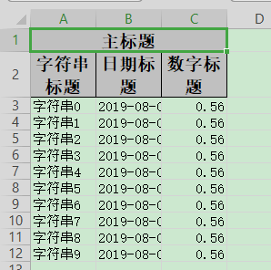

## 复杂头写入

### excel示例



### 对象

```java
@Getter
@Setter
@EqualsAndHashCode
public class ComplexHeadData {
    @ExcelProperty({"主标题", "字符串标题"})
    private String string;
    @ExcelProperty({"主标题", "日期标题"})
    private Date date;
    @ExcelProperty({"主标题", "数字标题"})
    private Double doubleData;
}
```

### 代码

```java
    /**
     * 复杂头写入
     * <p>1. 创建excel对应的实体对象 参照{@link ComplexHeadData}
     * <p>2. 使用{@link ExcelProperty}注解指定复杂的头
     * <p>3. 直接写即可
     */
    @Test
    public void complexHeadWrite() {
        String fileName = TestFileUtil.getPath() + "complexHeadWrite" + System.currentTimeMillis() + ".xlsx";
        // 这里 需要指定写用哪个class去写，然后写到第一个sheet，名字为模板 然后文件流会自动关闭
        EasyExcel.write(fileName, ComplexHeadData.class).sheet("模板").doWrite(data());
    }
```
