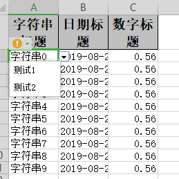

## 自定义拦截器（上面几点都不符合但是要对单元格进行操作的参照这个）

### excel示例



### 对象

参照：[最简单的写的对象](simpleWrite#最简单的写的对象)

### 定义拦截器

```java
/**
 * 自定义拦截器。对第一行第一列的头超链接到:https://github.com/alibaba/easyexcel
 *
 * @author Jiaju Zhuang
 */
@Slf4j
public class CustomCellWriteHandler implements CellWriteHandler {

    @Override
    public void afterCellDispose(CellWriteHandlerContext context) {
        Cell cell = context.getCell();
        // 这里可以对cell进行任何操作
        log.info("第{}行，第{}列写入完成。", cell.getRowIndex(), cell.getColumnIndex());
        if (BooleanUtils.isTrue(context.getHead()) && cell.getColumnIndex() == 0) {
            CreationHelper createHelper = context.getWriteSheetHolder().getSheet().getWorkbook().getCreationHelper();
            Hyperlink hyperlink = createHelper.createHyperlink(HyperlinkType.URL);
            hyperlink.setAddress("https://github.com/alibaba/easyexcel");
            cell.setHyperlink(hyperlink);
        }
    }

}
```

```java
/**
 * 自定义拦截器.对第一列第一行和第二行的数据新增下拉框，显示 测试1 测试2
 *
 * @author Jiaju Zhuang
 */
@Slf4j
public class CustomSheetWriteHandler implements SheetWriteHandler {

    @Override
    public void afterSheetCreate(SheetWriteHandlerContext context) {
        log.info("第{}个Sheet写入成功。", context.getWriteSheetHolder().getSheetNo());

        // 区间设置 第一列第一行和第二行的数据。由于第一行是头，所以第一、二行的数据实际上是第二三行
        CellRangeAddressList cellRangeAddressList = new CellRangeAddressList(1, 2, 0, 0);
        DataValidationHelper helper = context.getWriteSheetHolder().getSheet().getDataValidationHelper();
        DataValidationConstraint constraint = helper.createExplicitListConstraint(new String[] {"测试1", "测试2"});
        DataValidation dataValidation = helper.createValidation(constraint, cellRangeAddressList);
        context.getWriteSheetHolder().getSheet().addValidationData(dataValidation);
    }
}
```

### 代码

```java
    /**
     * 下拉，超链接等自定义拦截器（上面几点都不符合但是要对单元格进行操作的参照这个）
     * <p>
     * demo这里实现2点。1. 对第一行第一列的头超链接到:https://github.com/alibaba/easyexcel 2. 对第一列第一行和第二行的数据新增下拉框，显示 测试1 测试2
     * <p>
     * 1. 创建excel对应的实体对象 参照{@link DemoData}
     * <p>
     * 2. 注册拦截器 {@link CustomCellWriteHandler} {@link CustomSheetWriteHandler}
     * <p>
     * 2. 直接写即可
     */
    @Test
    public void customHandlerWrite() {
        String fileName = TestFileUtil.getPath() + "customHandlerWrite" + System.currentTimeMillis() + ".xlsx";
        // 这里 需要指定写用哪个class去写，然后写到第一个sheet，名字为模板 然后文件流会自动关闭
        EasyExcel.write(fileName, DemoData.class).registerWriteHandler(new CustomSheetWriteHandler())
            .registerWriteHandler(new CustomCellWriteHandler()).sheet("模板").doWrite(data());
    }
```

