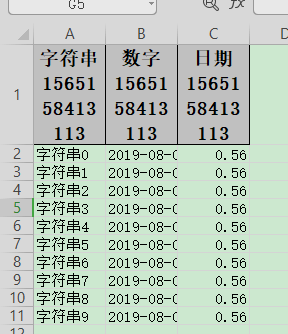

## 动态头，实时生成头写入

### excel示例



### 对象

参照：[最简单的写的对象](simpleWrite#最简单的写的对象)

### 代码

```java
    /**
     * 动态头，实时生成头写入
     * <p>
     * 思路是这样子的，先创建List<String>头格式的sheet仅仅写入头,然后通过table 不写入头的方式 去写入数据
     *
     * <p>
     * 1. 创建excel对应的实体对象 参照{@link DemoData}
     * <p>
     * 2. 然后写入table即可
     */
    @Test
    public void dynamicHeadWrite() {
        String fileName = TestFileUtil.getPath() + "dynamicHeadWrite" + System.currentTimeMillis() + ".xlsx";
        EasyExcel.write(fileName)
            // 这里放入动态头
            .head(head()).sheet("模板")
            // 当然这里数据也可以用 List<List<String>> 去传入
            .doWrite(data());
    }

    private List<List<String>> head() {
        List<List<String>> list = new ArrayList<List<String>>();
        List<String> head0 = new ArrayList<String>();
        head0.add("字符串" + System.currentTimeMillis());
        List<String> head1 = new ArrayList<String>();
        head1.add("数字" + System.currentTimeMillis());
        List<String> head2 = new ArrayList<String>();
        head2.add("日期" + System.currentTimeMillis());
        list.add(head0);
        list.add(head1);
        list.add(head2);
        return list;
    }
```
