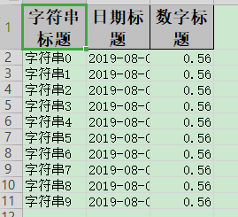

## 根据参数只导出指定列

### excel示例



### 对象

参照：[最简单的写的对象](easyWrite#最简单的写的对象)

### 代码

```java
    /**
     * 根据参数只导出指定列
     * <p>
     * 1. 创建excel对应的实体对象 参照{@link DemoData}
     * <p>
     * 2. 根据自己或者排除自己需要的列
     * <p>
     * 3. 直接写即可
     *
     * @since 2.1.1
     */
    @Test
    public void excludeOrIncludeWrite() {
        String fileName = TestFileUtil.getPath() + "excludeOrIncludeWrite" + System.currentTimeMillis() + ".xlsx";
        // 这里需要注意 在使用ExcelProperty注解的使用，如果想不空列则需要加入order字段，而不是index,order会忽略空列，然后继续往后，而index，不会忽略空列，在第几列就是第几列。

        // 根据用户传入字段 假设我们要忽略 date
        Set<String> excludeColumnFiledNames = new HashSet<String>();
        excludeColumnFiledNames.add("date");
        // 这里 需要指定写用哪个class去写，然后写到第一个sheet，名字为模板 然后文件流会自动关闭
        EasyExcel.write(fileName, DemoData.class).excludeColumnFiledNames(excludeColumnFiledNames).sheet("模板")
            .doWrite(data());

        fileName = TestFileUtil.getPath() + "excludeOrIncludeWrite" + System.currentTimeMillis() + ".xlsx";
        // 根据用户传入字段 假设我们只要导出 date
        Set<String> includeColumnFiledNames = new HashSet<String>();
        includeColumnFiledNames.add("date");
        // 这里 需要指定写用哪个class去写，然后写到第一个sheet，名字为模板 然后文件流会自动关闭
        EasyExcel.write(fileName, DemoData.class).includeColumnFiledNames(includeColumnFiledNames).sheet("模板")
            .doWrite(data());
    }
```

