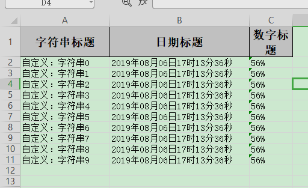

## 日期、数字或者自定义格式转换

### excel示例



### 对象

```java
@Getter
@Setter
@EqualsAndHashCode
public class ConverterData {
    /**
     * 我想所有的 字符串起前面加上"自定义："三个字
     */
    @ExcelProperty(value = "字符串标题", converter = CustomStringStringConverter.class)
    private String string;
    /**
     * 我想写到excel 用年月日的格式
     */
    @DateTimeFormat("yyyy年MM月dd日HH时mm分ss秒")
    @ExcelProperty("日期标题")
    private Date date;
    /**
     * 我想写到excel 用百分比表示
     */
    @NumberFormat("#.##%")
    @ExcelProperty(value = "数字标题")
    private Double doubleData;
}
```

### 代码

```java
    /**
     * 日期、数字或者自定义格式转换
     * <p>1. 创建excel对应的实体对象 参照{@link ConverterData}
     * <p>2. 使用{@link ExcelProperty}配合使用注解{@link DateTimeFormat}、{@link NumberFormat}或者自定义注解
     * <p>3. 直接写即可
     */
    @Test
    public void converterWrite() {
        String fileName = TestFileUtil.getPath() + "converterWrite" + System.currentTimeMillis() + ".xlsx";
        // 这里 需要指定写用哪个class去写，然后写到第一个sheet，名字为模板 然后文件流会自动关闭
        EasyExcel.write(fileName, ConverterData.class).sheet("模板").doWrite(data());
    }
```
