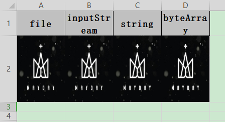

## 图片导出

### excel示例



### 对象

```java
@Getter
@Setter
@EqualsAndHashCode
@ContentRowHeight(100)
@ColumnWidth(100 / 8)
public class ImageDemoData {
    private File file;
    private InputStream inputStream;
    /**
     * 如果string类型 必须指定转换器，string默认转换成string
     */
    @ExcelProperty(converter = StringImageConverter.class)
    private String string;
    private byte[] byteArray;
    /**
     * 根据url导出
     *
     * @since 2.1.1
     */
    private URL url;

    /**
     * 根据文件导出 并设置导出的位置。
     *
     * @since 3.0.0-beta1
     */
    private WriteCellData<Void> writeCellDataFile;
}
```

### 代码

```java
   /**
     * 图片导出
     * <p>
     * 1. 创建excel对应的实体对象 参照{@link ImageDemoData}
     * <p>
     * 2. 直接写即可
     */
    @Test
    public void imageWrite() throws Exception {
        String fileName = TestFileUtil.getPath() + "imageWrite" + System.currentTimeMillis() + ".xlsx";

        // 这里注意下 所有的图片都会放到内存 暂时没有很好的解法，大量图片的情况下建议 2选1:
        // 1. 将图片上传到oss 或者其他存储网站: https://www.aliyun.com/product/oss ，然后直接放链接
        // 2. 使用: https://github.com/coobird/thumbnailator 或者其他工具压缩图片
        
        String imagePath = TestFileUtil.getPath() + "converter" + File.separator + "img.jpg";
        try (InputStream inputStream = FileUtils.openInputStream(new File(imagePath))) {
            List<ImageDemoData> list =  ListUtils.newArrayList();
            ImageDemoData imageDemoData = new ImageDemoData();
            list.add(imageDemoData);
            // 放入五种类型的图片 实际使用只要选一种即可
            imageDemoData.setByteArray(FileUtils.readFileToByteArray(new File(imagePath)));
            imageDemoData.setFile(new File(imagePath));
            imageDemoData.setString(imagePath);
            imageDemoData.setInputStream(inputStream);
            imageDemoData.setUrl(new URL(
                "https://raw.githubusercontent.com/alibaba/easyexcel/master/src/test/resources/converter/img.jpg"));

            // 这里演示
            // 需要额外放入文字
            // 而且需要放入2个图片
            // 第一个图片靠左
            // 第二个靠右 而且要额外的占用他后面的单元格
            WriteCellData<Void> writeCellData = new WriteCellData<>();
            imageDemoData.setWriteCellDataFile(writeCellData);
            // 这里可以设置为 EMPTY 则代表不需要其他数据了
            writeCellData.setType(CellDataTypeEnum.STRING);
            writeCellData.setStringValue("额外的放一些文字");

            // 可以放入多个图片
            List<ImageData> imageDataList = new ArrayList<>();
            ImageData imageData = new ImageData();
            imageDataList.add(imageData);
            writeCellData.setImageDataList(imageDataList);
            // 放入2进制图片
            imageData.setImage(FileUtils.readFileToByteArray(new File(imagePath)));
            // 图片类型
            imageData.setImageType(ImageType.PICTURE_TYPE_PNG);
            // 上 右 下 左 需要留空
            // 这个类似于 css 的 margin
            // 这里实测 不能设置太大 超过单元格原始大小后 打开会提示修复。暂时未找到很好的解法。
            imageData.setTop(5);
            imageData.setRight(40);
            imageData.setBottom(5);
            imageData.setLeft(5);

            // 放入第二个图片
            imageData = new ImageData();
            imageDataList.add(imageData);
            writeCellData.setImageDataList(imageDataList);
            imageData.setImage(FileUtils.readFileToByteArray(new File(imagePath)));
            imageData.setImageType(ImageType.PICTURE_TYPE_PNG);
            imageData.setTop(5);
            imageData.setRight(5);
            imageData.setBottom(5);
            imageData.setLeft(50);
            // 设置图片的位置 假设 现在目标 是 覆盖 当前单元格 和当前单元格右边的单元格
            // 起点相对于当前单元格为0 当然可以不写
            imageData.setRelativeFirstRowIndex(0);
            imageData.setRelativeFirstColumnIndex(0);
            imageData.setRelativeLastRowIndex(0);
            // 前面3个可以不写  下面这个需要写 也就是 结尾 需要相对当前单元格 往右移动一格
            // 也就是说 这个图片会覆盖当前单元格和 后面的那一格
            imageData.setRelativeLastColumnIndex(1);

            // 写入数据
            EasyExcel.write(fileName, ImageDemoData.class).sheet().doWrite(list);
        }
    }
```
