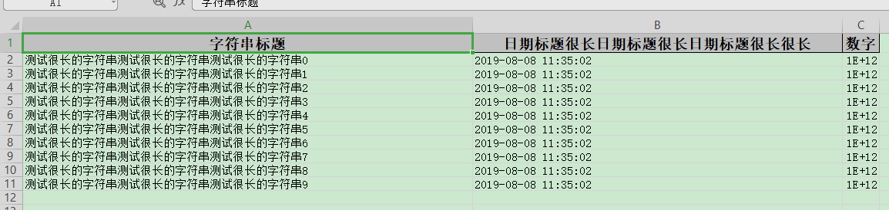

## 自动列宽(不太精确)

### excel示例



### 对象

```java
@Getter
@Setter
@EqualsAndHashCode
public class LongestMatchColumnWidthData {
    @ExcelProperty("字符串标题")
    private String string;
    @ExcelProperty("日期标题很长日期标题很长日期标题很长很长")
    private Date date;
    @ExcelProperty("数字")
    private Double doubleData;
}
```

### 代码

```java
   /**
     * 自动列宽(不太精确)
     * <p>
     * 这个目前不是很好用，比如有数字就会导致换行。而且长度也不是刚好和实际长度一致。 所以需要精确到刚好列宽的慎用。 当然也可以自己参照
     * {@link LongestMatchColumnWidthStyleStrategy}重新实现.
     * <p>
     * poi 自带{@link SXSSFSheet#autoSizeColumn(int)} 对中文支持也不太好。目前没找到很好的算法。 有的话可以推荐下。
     *
     * <p>
     * 1. 创建excel对应的实体对象 参照{@link LongestMatchColumnWidthData}
     * <p>
     * 2. 注册策略{@link LongestMatchColumnWidthStyleStrategy}
     * <p>
     * 3. 直接写即可
     */
    @Test
    public void longestMatchColumnWidthWrite() {
        String fileName =
            TestFileUtil.getPath() + "longestMatchColumnWidthWrite" + System.currentTimeMillis() + ".xlsx";
        // 这里 需要指定写用哪个class去写，然后写到第一个sheet，名字为模板 然后文件流会自动关闭
        EasyExcel.write(fileName, LongestMatchColumnWidthData.class)
            .registerWriteHandler(new LongestMatchColumnWidthStyleStrategy()).sheet("模板").doWrite(dataLong());
    }

    private List<LongestMatchColumnWidthData> dataLong() {
        List<LongestMatchColumnWidthData> list = new ArrayList<LongestMatchColumnWidthData>();
        for (int i = 0; i < 10; i++) {
            LongestMatchColumnWidthData data = new LongestMatchColumnWidthData();
            data.setString("测试很长的字符串测试很长的字符串测试很长的字符串" + i);
            data.setDate(new Date());
            data.setDoubleData(1000000000000.0);
            list.add(data);
        }
        return list;
    }
```
