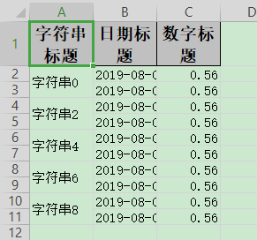

## 合并单元格

### since

2.2.0-beta1

### excel示例



### 对象

方法1

```java
@Getter
@Setter
@EqualsAndHashCode
// 将第6-7行的2-3列合并成一个单元格
// @OnceAbsoluteMerge(firstRowIndex = 5, lastRowIndex = 6, firstColumnIndex = 1, lastColumnIndex = 2)
public class DemoMergeData {
    // 这一列 每隔2行 合并单元格
    @ContentLoopMerge(eachRow = 2)
    @ExcelProperty("字符串标题")
    private String string;
    @ExcelProperty("日期标题")
    private Date date;
    @ExcelProperty("数字标题")
    private Double doubleData;
}
```

方法2参照：[最简单的写的对象](simpleWrite#最简单的写的对象)

### 代码

```java
   /**
     * 合并单元格
     * <p>
     * 1. 创建excel对应的实体对象 参照{@link DemoData} {@link DemoMergeData}
     * <p>
     * 2. 创建一个merge策略 并注册
     * <p>
     * 3. 直接写即可
     *
     * @since 2.2.0-beta1
     */
    @Test
    public void mergeWrite() {
        // 方法1 注解
        String fileName = TestFileUtil.getPath() + "mergeWrite" + System.currentTimeMillis() + ".xlsx";
        // 在DemoStyleData里面加上ContentLoopMerge注解
        // 这里 需要指定写用哪个class去写，然后写到第一个sheet，名字为模板 然后文件流会自动关闭
        EasyExcel.write(fileName, DemoMergeData.class).sheet("模板").doWrite(data());

        // 方法2 自定义合并单元格策略
        fileName = TestFileUtil.getPath() + "mergeWrite" + System.currentTimeMillis() + ".xlsx";
        // 每隔2行会合并 把eachColumn 设置成 3 也就是我们数据的长度，所以就第一列会合并。当然其他合并策略也可以自己写
        LoopMergeStrategy loopMergeStrategy = new LoopMergeStrategy(2, 0);
        // 这里 需要指定写用哪个class去写，然后写到第一个sheet，名字为模板 然后文件流会自动关闭
        EasyExcel.write(fileName, DemoData.class).registerWriteHandler(loopMergeStrategy).sheet("模板").doWrite(data());
    }
```