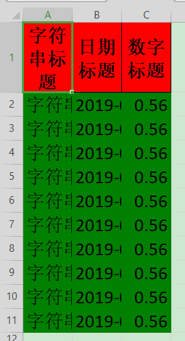

## 自定义样式

### excel示例



### 对象

参照：[最简单的写的对象](simpleWrite#最简单的写的对象)

### 代码

```java
    /**
     * 拦截器形式自定义样式
     * <p>
     * 1. 创建excel对应的实体对象 参照{@link DemoData}
     * <p>
     * 2. 创建一个style策略 并注册
     * <p>
     * 3. 直接写即可
     */
    @Test
    public void handlerStyleWrite() {
        // 方法1 使用已有的策略 推荐
        // HorizontalCellStyleStrategy 每一行的样式都一样 或者隔行一样
        // AbstractVerticalCellStyleStrategy 每一列的样式都一样 需要自己回调每一页
        String fileName = TestFileUtil.getPath() + "handlerStyleWrite" + System.currentTimeMillis() + ".xlsx";
        // 头的策略
        WriteCellStyle headWriteCellStyle = new WriteCellStyle();
        // 背景设置为红色
        headWriteCellStyle.setFillForegroundColor(IndexedColors.RED.getIndex());
        WriteFont headWriteFont = new WriteFont();
        headWriteFont.setFontHeightInPoints((short)20);
        headWriteCellStyle.setWriteFont(headWriteFont);
        // 内容的策略
        WriteCellStyle contentWriteCellStyle = new WriteCellStyle();
        // 这里需要指定 FillPatternType 为FillPatternType.SOLID_FOREGROUND 不然无法显示背景颜色.头默认了 FillPatternType所以可以不指定
        contentWriteCellStyle.setFillPatternType(FillPatternType.SOLID_FOREGROUND);
        // 背景绿色
        contentWriteCellStyle.setFillForegroundColor(IndexedColors.GREEN.getIndex());
        WriteFont contentWriteFont = new WriteFont();
        // 字体大小
        contentWriteFont.setFontHeightInPoints((short)20);
        contentWriteCellStyle.setWriteFont(contentWriteFont);
        // 这个策略是 头是头的样式 内容是内容的样式 其他的策略可以自己实现
        HorizontalCellStyleStrategy horizontalCellStyleStrategy =
            new HorizontalCellStyleStrategy(headWriteCellStyle, contentWriteCellStyle);

        // 这里 需要指定写用哪个class去写，然后写到第一个sheet，名字为模板 然后文件流会自动关闭
        EasyExcel.write(fileName, DemoData.class)
            .registerWriteHandler(horizontalCellStyleStrategy)
            .sheet("模板")
            .doWrite(data());

        // 方法2: 使用easyexcel的方式完全自己写 不太推荐 尽量使用已有策略
        // @since 3.0.0-beta2
        fileName = TestFileUtil.getPath() + "handlerStyleWrite" + System.currentTimeMillis() + ".xlsx";
        EasyExcel.write(fileName, DemoData.class)
            .registerWriteHandler(new CellWriteHandler() {
                @Override
                public void afterCellDispose(CellWriteHandlerContext context) {
                    // 当前事件会在 数据设置到poi的cell里面才会回调
                    // 判断不是头的情况 如果是fill 的情况 这里会==null 所以用not true
                    if (BooleanUtils.isNotTrue(context.getHead())) {
                        // 第一个单元格
                        // 只要不是头 一定会有数据 当然fill的情况 可能要context.getCellDataList() ,这个需要看模板，因为一个单元格会有多个 WriteCellData
                        WriteCellData<?> cellData = context.getFirstCellData();
                        // 这里需要去cellData 获取样式
                        // 很重要的一个原因是 WriteCellStyle 和 dataFormatData绑定的 简单的说 比如你加了 DateTimeFormat
                        // ，已经将writeCellStyle里面的dataFormatData 改了 如果你自己new了一个WriteCellStyle，可能注解的样式就失效了
                        // 然后 getOrCreateStyle 用于返回一个样式，如果为空，则创建一个后返回
                        WriteCellStyle writeCellStyle = cellData.getOrCreateStyle();
                        writeCellStyle.setFillForegroundColor(IndexedColors.RED.getIndex());
                        // 这里需要指定 FillPatternType 为FillPatternType.SOLID_FOREGROUND
                        writeCellStyle.setFillPatternType(FillPatternType.SOLID_FOREGROUND);

                        // 这样样式就设置好了 后面有个FillStyleCellWriteHandler 默认会将 WriteCellStyle 设置到 cell里面去 所以可以不用管了
                    }
                }
            }).sheet("模板")
            .doWrite(data());

        // 方法3: 使用poi的样式完全自己写 不推荐
        // @since 3.0.0-beta2
        // 坑1：style里面有dataformat 用来格式化数据的 所以自己设置可能导致格式化注解不生效
        // 坑2：不要一直去创建style 记得缓存起来 最多创建6W个就挂了
        fileName = TestFileUtil.getPath() + "handlerStyleWrite" + System.currentTimeMillis() + ".xlsx";
        EasyExcel.write(fileName, DemoData.class)
            .registerWriteHandler(new CellWriteHandler() {
                @Override
                public void afterCellDispose(CellWriteHandlerContext context) {
                    // 当前事件会在 数据设置到poi的cell里面才会回调
                    // 判断不是头的情况 如果是fill 的情况 这里会==null 所以用not true
                    if (BooleanUtils.isNotTrue(context.getHead())) {
                        Cell cell = context.getCell();
                        // 拿到poi的workbook
                        Workbook workbook = context.getWriteWorkbookHolder().getWorkbook();
                        // 这里千万记住 想办法能复用的地方把他缓存起来 一个表格最多创建6W个样式
                        // 不同单元格尽量传同一个 cellStyle
                        CellStyle cellStyle = workbook.createCellStyle();
                        cellStyle.setFillForegroundColor(IndexedColors.RED.getIndex());
                        // 这里需要指定 FillPatternType 为FillPatternType.SOLID_FOREGROUND
                        cellStyle.setFillPattern(FillPatternType.SOLID_FOREGROUND);
                        cell.setCellStyle(cellStyle);

                        // 由于这里没有指定dataformat 最后展示的数据 格式可能会不太正确

                        // 这里要把 WriteCellData的样式清空， 不然后面还有一个拦截器 FillStyleCellWriteHandler 默认会将 WriteCellStyle 设置到
                        // cell里面去 会导致自己设置的不一样
                        context.getFirstCellData().setWriteCellStyle(null);
                    }
                }
            }).sheet("模板")
            .doWrite(data());
    }
```
