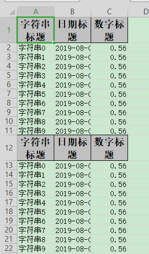

## 使用table去写入

### excel示例



### 对象

参照：[最简单的写的对象](simpleWrite#最简单的写的对象)

### 代码

```java
    /**
     * 使用table去写入
     * <p>
     * 1. 创建excel对应的实体对象 参照{@link DemoData}
     * <p>
     * 2. 然后写入table即可
     */
    @Test
    public void tableWrite() {
        String fileName = TestFileUtil.getPath() + "tableWrite" + System.currentTimeMillis() + ".xlsx";
        // 方法1 这里直接写多个table的案例了，如果只有一个 也可以直一行代码搞定，参照其他案
        // 这里 需要指定写用哪个class去写
        try (ExcelWriter excelWriter = EasyExcel.write(fileName, DemoData.class).build()) {
            // 把sheet设置为不需要头 不然会输出sheet的头 这样看起来第一个table 就有2个头了
            WriteSheet writeSheet = EasyExcel.writerSheet("模板").needHead(Boolean.FALSE).build();
            // 这里必须指定需要头，table 会继承sheet的配置，sheet配置了不需要，table 默认也是不需要
            WriteTable writeTable0 = EasyExcel.writerTable(0).needHead(Boolean.TRUE).build();
            WriteTable writeTable1 = EasyExcel.writerTable(1).needHead(Boolean.TRUE).build();
            // 第一次写入会创建头
            excelWriter.write(data(), writeSheet, writeTable0);
            // 第二次写如也会创建头，然后在第一次的后面写入数据
            excelWriter.write(data(), writeSheet, writeTable1);
        }
    }
```

