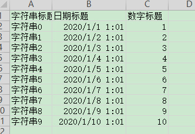
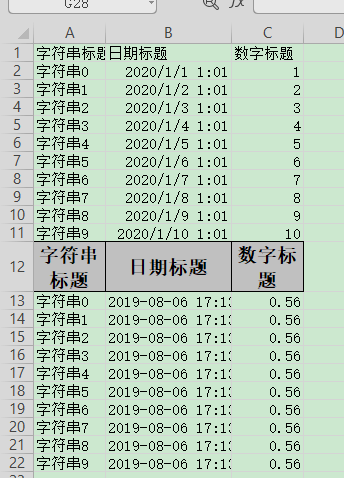

## 根据模板写入

### 模板excel示例



### excel示例



### 对象

参照：[最简单的写的对象](simpleWrite#最简单的写的对象)

### 代码

```java
    /**
     * 根据模板写入
     * <p>1. 创建excel对应的实体对象 参照{@link IndexData}
     * <p>2. 使用{@link ExcelProperty}注解指定写入的列
     * <p>3. 使用withTemplate 写取模板
     * <p>4. 直接写即可
     */
    @Test
    public void templateWrite() {
        String templateFileName = TestFileUtil.getPath() + "demo" + File.separator + "demo.xlsx";
        String fileName = TestFileUtil.getPath() + "templateWrite" + System.currentTimeMillis() + ".xlsx";
        // 这里 需要指定写用哪个class去写，然后写到第一个sheet，名字为模板 然后文件流会自动关闭
        // 这里要注意 withTemplate 的模板文件会全量存储在内存里面，所以尽量不要用于追加文件，如果文件模板文件过大会OOM
        // 如果要再文件中追加（无法在一个线程里面处理，可以在一个线程的建议参照多次写入的demo） 建议临时存储到数据库 或者 磁盘缓存(ehcache) 然后再一次性写入
        EasyExcel.write(fileName, DemoData.class).withTemplate(templateFileName).sheet().doWrite(data());
    }
```