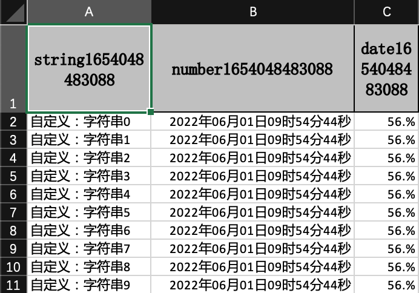

## 可变标题处理(包括标题国际化等)

### excel示例



### 对象

```java
@Getter
@Setter
@EqualsAndHashCode
public class ConverterData {
    /**
     * 我想所有的 字符串起前面加上"自定义："三个字
     */
    @ExcelProperty(value = "字符串标题", converter = CustomStringStringConverter.class)
    private String string;
    /**
     * 我想写到excel 用年月日的格式
     */
    @DateTimeFormat("yyyy年MM月dd日HH时mm分ss秒")
    @ExcelProperty("日期标题")
    private Date date;
    /**
     * 我想写到excel 用百分比表示
     */
    @NumberFormat("#.##%")
    @ExcelProperty(value = "数字标题")
    private Double doubleData;
}
```

### 代码

```java
    /**
     * 可变标题处理(包括标题国际化等)
     * <p>
     * 简单的说用List<List<String>>的标题 但是还支持注解
     * <p>
     * 1. 创建excel对应的实体对象 参照{@link ConverterData}
     * <p>
     * 2. 直接写即可
     */
    @Test
    public void variableTitleWrite() {
        // 写法1
        String fileName = TestFileUtil.getPath() + "variableTitleWrite" + System.currentTimeMillis() + ".xlsx";
        // 这里 需要指定写用哪个class去写，然后写到第一个sheet，名字为模板 然后文件流会自动关闭
        EasyExcel.write(fileName, ConverterData.class).head(variableTitleHead()).sheet("模板").doWrite(data());
    }

    private List<List<String>> variableTitleHead() {
        List<List<String>> list = ListUtils.newArrayList();
        List<String> head0 = ListUtils.newArrayList();
        head0.add("string" + System.currentTimeMillis());
        List<String> head1 = ListUtils.newArrayList();
        head1.add("number" + System.currentTimeMillis());
        List<String> head2 = ListUtils.newArrayList();
        head2.add("date" + System.currentTimeMillis());
        list.add(head0);
        list.add(head1);
        list.add(head2);
        return list;
    }    private List<List<String>> variableTitleHead() {
        List<List<String>> list = new ArrayList<>();
        List<String> head0 = new ArrayList<>();
        head0.add("string" + System.currentTimeMillis());
        List<String> head1 = new ArrayList<>();
        head1.add("number" + System.currentTimeMillis());
        List<String> head2 = new ArrayList<>();
        head2.add("date" + System.currentTimeMillis());
        list.add(head0);
        list.add(head1);
        list.add(head2);
        return list;
    }
```
