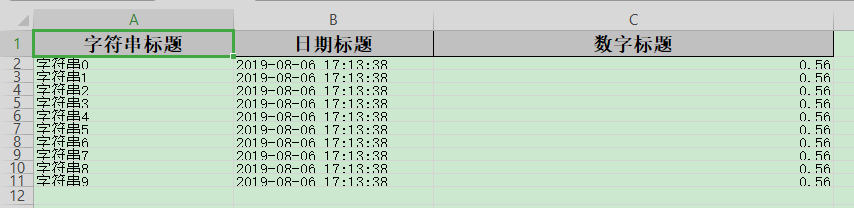

## 列宽、行高

### excel示例



### 对象

```java
@Getter
@Setter
@EqualsAndHashCode
@ContentRowHeight(10)
@HeadRowHeight(20)
@ColumnWidth(25)
public class WidthAndHeightData {
    @ExcelProperty("字符串标题")
    private String string;
    @ExcelProperty("日期标题")
    private Date date;
    /**
     * 宽度为50
     */
    @ColumnWidth(50)
    @ExcelProperty("数字标题")
    private Double doubleData;
}
```

### 代码

```java
    /**
     * 列宽、行高
     * <p>1. 创建excel对应的实体对象 参照{@link WidthAndHeightData}
     * <p>2. 使用注解{@link ColumnWidth}、{@link HeadRowHeight}、{@link ContentRowHeight}指定宽度或高度
     * <p>3. 直接写即可
     */
    @Test
    public void widthAndHeightWrite() {
        String fileName = TestFileUtil.getPath() + "widthAndHeightWrite" + System.currentTimeMillis() + ".xlsx";
        // 这里 需要指定写用哪个class去写，然后写到第一个sheet，名字为模板 然后文件流会自动关闭
        EasyExcel.write(fileName, WidthAndHeightData.class).sheet("模板").doWrite(data());
    }
```
