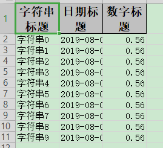

## 不创建对象的写

### excel示例



### 代码

```java
    /**
     * 不创建对象的写
     */
    @Test
    public void noModelWrite() {
        // 写法1
        String fileName = TestFileUtil.getPath() + "noModelWrite" + System.currentTimeMillis() + ".xlsx";
        // 这里 需要指定写用哪个class去写，然后写到第一个sheet，名字为模板 然后文件流会自动关闭
        EasyExcel.write(fileName).head(head()).sheet("模板").doWrite(dataList());
    }

    private List<List<String>> head() {
        List<List<String>> list = ListUtils.newArrayList();
        List<String> head0 = ListUtils.newArrayList();
        head0.add("字符串" + System.currentTimeMillis());
        List<String> head1 = ListUtils.newArrayList();
        head1.add("数字" + System.currentTimeMillis());
        List<String> head2 = ListUtils.newArrayList();
        head2.add("日期" + System.currentTimeMillis());
        list.add(head0);
        list.add(head1);
        list.add(head2);
        return list;
    }

    private List<List<Object>> dataList() {
        List<List<Object>> list = ListUtils.newArrayList();
        for (int i = 0; i < 10; i++) {
            List<Object> data = ListUtils.newArrayList();
            data.add("字符串" + i);
            data.add(0.56);
            data.add(new Date());
            list.add(data);
        }
        return list;
    }
```

